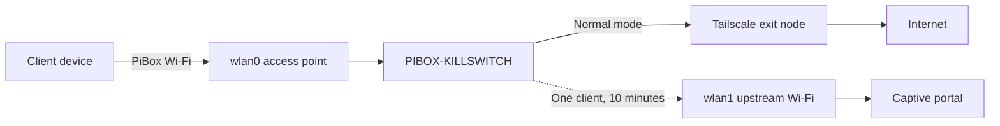

# PiBox Portable Router

PiBox turns a Raspberry Pi into a portable, dual-radio Wi-Fi router with a
Tailscale-protected default path and a deliberately narrow escape hatch for
captive-portal authentication.

The built-in Raspberry Pi radio (`wlan0`) provides the private client access
point. A USB Wi-Fi adapter (`wlan1`) joins a hotel, workplace, or other upstream
network. Normal client traffic is forced through a selected Tailscale exit node.
If the upstream network requires browser-based terms-of-service acceptance,
Guest Login Mode temporarily gives one requesting client direct upstream IPv4
access for ten minutes.

> [!WARNING]
> The provisioning scripts replace network, DHCP, DNS, web-server, firewall,
> and wireless configuration on the target. Use a dedicated Raspberry Pi,
> maintain console access, and run the read-only preflight before `-Apply`.

Use PiBox only on networks you are authorized to access. Guest Login Mode is
intended to complete legitimate captive-portal authentication, not to bypass
access controls or network policy.

## Traffic paths



## What is included

- Guarded PowerShell orchestration with a read-only default mode
- Raspberry Pi 3B and Raspberry Pi 5 profiles
- RaspAP 3.5.5 pinned to verified revisions
- Persistent Tailscale routing, NAT, kill switch, and TCP MSS clamping
- Authenticated, CSRF-protected Guest Login Mode
- A Windows DPAPI option for moving a private configuration bundle offline
- A comprehensive post-install verifier

## Current release boundary

Version 0.1 provisions a new PiBox from an existing trusted PiBox configuration
or from a DPAPI-encrypted export of that configuration. A clean-room first-device
wizard is planned but is not included yet. Never use configuration from an
untrusted source appliance.

## Default hardware

- Raspberry Pi 5 Model B or Raspberry Pi 3 Model B Rev 1.2
- 64-bit Raspberry Pi OS Lite based on Debian 13
- TP-Link Archer TX20U Nano (`35bc:0108`, `rtw89_8852bu`) as `wlan1`
- Wired Ethernet for provisioning only

Other observed adapters are documented in [Hardware](docs/HARDWARE.md).

## Quick start

1. Read [Security](SECURITY.md), [Architecture](docs/ARCHITECTURE.md), and the
   [configuration contract](PIBOX-CLONE-SPEC.md).
2. Flash the target, create user `pibox`, enable SSH public-key authentication,
   connect Ethernet, and attach the USB Wi-Fi adapter.
3. Run a read-only preflight from PowerShell:

   ```powershell
   .\provision\Invoke-PiBoxClone.ps1 `
     -TargetAddress 192.168.1.123 `
     -TargetIdentityFile $HOME\.ssh\pibox_ed25519 `
     -SourceAddress 100.64.0.10 `
     -SourceIdentityFile $HOME\.ssh\pibox_ed25519
   ```

4. Review the output, then repeat the command with `-Apply` and a unique
   `-TargetHostname`.
5. Reboot and enroll the target as a fresh Tailscale node. Never copy
   `/var/lib/tailscale` between devices.
6. Run the verifier with your selected exit-node Tailscale address:

   ```sh
   sudo bash provision/pibox-verify.sh 100.64.0.20 rtw89_8852bu
   ```

Full instructions are in [Provisioning](provision/README.md).

## Project status

This project is an independently maintained integration built around Raspberry
Pi OS, RaspAP, and Tailscale. It is not affiliated with Raspberry Pi Ltd,
RaspAP, Tailscale Inc., TP-Link, or NeverSSL.

Contributions, hardware reports, documentation improvements, and security review
are welcome. See [CONTRIBUTING.md](CONTRIBUTING.md).

## License

GPL-3.0-only. See [LICENSE](LICENSE) and [NOTICE](NOTICE).
