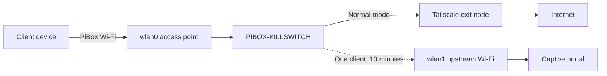

# PiBox Portable Router

PiBox turns a Raspberry Pi into a portable, dual-radio Wi-Fi router with a
Tailscale-protected default path and a deliberately narrow escape hatch for
captive-portal authentication.

The built-in Raspberry Pi radio (`wlan0`) provides the private client access
point. A USB Wi-Fi adapter (`wlan1`) joins a hotel, workplace, or other upstream
network. Normal client traffic is forced through a selected Tailscale exit node.
If the upstream network requires browser-based terms-of-service acceptance,
Guest Login Mode temporarily gives one requesting client direct upstream IPv4
access for ten minutes.

> [!WARNING]
> The provisioning scripts replace network, DHCP, DNS, web-server, firewall,
> and wireless configuration on the target. Use a dedicated Raspberry Pi,
> maintain console access, and run the read-only preflight before `-Apply`.

Use PiBox only on networks you are authorized to access. Guest Login Mode is
intended to complete legitimate captive-portal authentication, not to bypass
access controls or network policy.

> [!IMPORTANT]
> Normal PiBox internet access requires Tailscale and a working Tailscale exit
> node. This release does not provide a permanent direct-to-host-Wi-Fi mode.
> After Guest Login Mode closes, the kill switch blocks client traffic unless
> the Tailscale exit path is working.

## Three names to understand

| Name | Meaning |
|---|---|
| **PiBox Wi-Fi** | The private, hidden SSID created during installation. Your phone, tablet, or laptop connects to this network through `wlan0`. |
| **Host Wi-Fi** | The hotel, workplace, or home network that gives the Pi internet access. The USB adapter connects to this network through `wlan1`. |
| **Tailscale exit node** | A separate trusted device, usually at home, through which PiBox sends normal internet traffic. |

## Traffic paths



## What is included

- Guarded PowerShell orchestration with a read-only default mode
- A first-device installer that generates private configuration from guided,
  validated input instead of requiring an existing PiBox
- Raspberry Pi 3B and Raspberry Pi 5 profiles
- RaspAP 3.5.5 pinned to verified revisions
- Persistent Tailscale routing, NAT, kill switch, and TCP MSS clamping
- Authenticated, CSRF-protected Guest Login Mode
- A Windows DPAPI option for moving a private configuration bundle offline
- A comprehensive post-install verifier

## Current release boundary

The project can provision a first PiBox from a fresh supported Raspberry Pi OS
Lite installation or reproduce an existing trusted PiBox. It does not flash the
SD card, create the initial `pibox` account, install the SSH public key, or enroll
Tailscale automatically. Those identity-bearing steps remain under the owner's
control.

## Default hardware

- Raspberry Pi 5 Model B or Raspberry Pi 3 Model B Rev 1.2
- 64-bit Raspberry Pi OS Lite based on Debian 13
- TP-Link Archer TX20U Nano (`35bc:0108`, `rtw89_8852bu`) as `wlan1`
- Wired Ethernet for provisioning only

Other observed adapters are documented in [Hardware](docs/HARDWARE.md).

## Quick start

1. Read [Security](SECURITY.md), [Architecture](docs/ARCHITECTURE.md), and the
   [configuration contract](PIBOX-CLONE-SPEC.md).
2. Flash the target, create user `pibox`, enable SSH public-key authentication,
   connect Ethernet, and attach the USB Wi-Fi adapter.
3. Run the first-device installer without `-Apply`. This is a read-only
   hardware and connection preview:

   ```powershell
   .\provision\Invoke-PiBoxFirstInstall.ps1 `
     -TargetAddress 192.168.1.123 `
     -TargetIdentityFile $HOME\.ssh\pibox_ed25519 `
     -TargetHostname pibox-router `
     -AccessPointSsid MyPiBox `
     -UpstreamSsid MyHomeWiFi
   ```

4. Review the output, then repeat the same command with `-Apply`. The installer
   privately prompts for the PiBox Wi-Fi, RaspAP administrator, and optional
   upstream Wi-Fi passwords. Passwords are not placed on the command line or
   written to this repository.
5. Reboot and enroll the target as a fresh Tailscale node. Never copy
   `/var/lib/tailscale` between devices.
6. Run the verifier with your selected exit-node Tailscale address:

   ```sh
   sudo pibox-verify 100.64.0.20 rtw89_8852bu
   ```

7. Connect a phone, tablet, or laptop to the hidden PiBox SSID. Open
   `http://10.3.141.1`, use **WiFi client** to connect `wlan1` to the host
   Wi-Fi, and then use `http://10.3.141.1/portal.php` if that network requires
   terms-of-service acceptance.

Start with the [First-device guide](docs/FIRST-INSTALL.md). Existing PiBox
owners can instead use the [clone workflow](provision/README.md#clone-an-existing-pibox).

For the exact buttons to press whenever you arrive at a new hotel or workplace,
follow [Using PiBox](docs/USING-PIBOX.md).

## Project status

This project is an independently maintained integration built around Raspberry
Pi OS, RaspAP, and Tailscale. It is not affiliated with Raspberry Pi Ltd,
RaspAP, Tailscale Inc., TP-Link, or NeverSSL.

Contributions, hardware reports, documentation improvements, and security review
are welcome. See [CONTRIBUTING.md](CONTRIBUTING.md).

## License

GPL-3.0-only. See [LICENSE](LICENSE) and [NOTICE](NOTICE).
